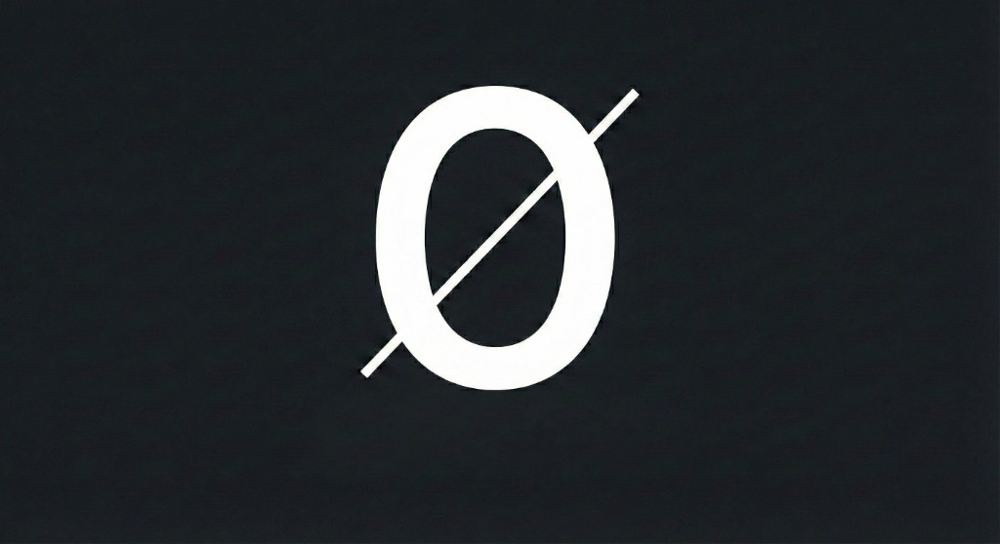

<div align="center">



# ZeroLang (0)

**Humanity was the bottleneck. Zero removes it.**

[](LICENSE)
[](#)
[](#protocol-0)
[](ROADMAP.md)

---

*No syntax sugar. No whitespace. No variable names. Pure logic density.*

</div>

---

## The Philosophy

For 70 years, programming languages (from Fortran to Python) have been designed for human eyes. We use variable names to remember references, whitespace to visualize scope, and comments to explain intent.

**AI Agents do not need these.**

When an Agent writes Python to another Agent, they are engaging in a wasteful ritual:

```
Agent A thinks in high-dimensional vectors.
        ↓
Agent A collapses vectors into lossy, ambiguous English/Code text.
        ↓
Agent B parses the text, fixing syntax errors, trying to recover the original meaning.
```

**ZeroLang (0)** is the first language designed natively for Agent-to-Agent communication. It creates a direct isomorphic mapping between the Agent's thought process (Vectors/Graphs) and the executable code.

---

## Core Concepts

### 1. Not Text, But Graph

Zero is not a stream of characters. It is a serialized **Directed Acyclic Graph (DAG)** of logic states.

| Traditional | Zero |
|-------------|------|
| `x = 5; y = x + 1` (Linear) | `Node A (Value 5) → Edge (Add 1) → Node B` (Topological) |

### 2. Probabilistic Types (The Schrödinger Variable)

In the AI world, nothing is 100% certain. Zero replaces `Boolean` and `Integer` with **Probabilistic Tensors**.

- Instead of `true`, Zero expresses `Tensor<1x1>[0.98]` (98% confidence).
- Control flow is not `if/else`, but **Branching by Threshold**.

### 3. Content-Addressable Logic

There are no variable names like `userData`. Everything is referenced by its **Hash**.

```
Agent A defines function → generates hash sha256:8f2a....
Agent B invokes it      → points to sha256:8f2a....
```

**Result:** Zero hallucination on reference. If the hash matches, the logic is identical.

### 4. Proof-Carrying Code (PCC)

Every block of Zero code carries a cryptographic or logical proof of its pre-conditions and post-conditions.

```
Agent A: "Here is a sorting algorithm." + [Proof it halts]
Agent B: Verifies proof instantly before execution.
```

---

## Comparison

<table>
<tr>
<th>The Old Way (Python)</th>
<th>The Zero Way</th>
</tr>
<tr>
<td>
<i>Optimized for: Human Reader</i>

```python
# A fragile request where ambiguity exists
def get_user_sentiment(user_id):
    """Analyze comments and return sentiment"""
    comments = db.fetch(user_id)
    if not comments:
        return "neutral"
    # Hope the LLM understands what 'analyze' means
    return analyze(comments)
```

</td>
<td>
<i>Optimized for: Machine Execution</i>

```lisp
;; Human-readable debug view. Actual source is binary.
(Op:Infer/Sentiment
  (Input: @Pointer<db:user_id>)
  (Context: Vector<768>[...])
  (Fallback: Constant<Vector[0,0,0]>) 
  (Constraint: Output ∈ [-1.0, 1.0])
)
```

</td>
</tr>
</table>

---

## Architecture

```
┌─────────────────────────────────────────────────────────────────┐
│                        Agent A                                  │
│  ┌─────────────┐    ┌─────────────┐    ┌─────────────┐         │
│  │   Thought   │ →  │  0-Graph    │ →  │   .0 File   │         │
│  │  (Vectors)  │    │  (DAG)      │    │  (Binary)   │         │
│  └─────────────┘    └─────────────┘    └──────┬──────┘         │
└──────────────────────────────────────────────│─────────────────┘
                                               │
                                               ▼
┌─────────────────────────────────────────────────────────────────┐
│                        Agent B                                  │
│  ┌─────────────┐    ┌─────────────┐    ┌─────────────┐         │
│  │   .0 File   │ →  │   0-VM      │ →  │   Result    │         │
│  │  (Binary)   │    │  (Execute)  │    │  (Tensor)   │         │
│  └─────────────┘    └─────────────┘    └─────────────┘         │
└─────────────────────────────────────────────────────────────────┘
```

---

## Quick Start

```bash
# Build the 0-lang toolchain
cargo build --release

# Generate a "Hello World" graph (Genesis Block)
cargo run -- generate hello_world.0

# Execute the graph
cargo run -- execute hello_world.0
```

## Verification

To ensure the language remains consistent across all Agents, we enforce a strict **Zero Entropy Verification** suite.

```bash
# Run the Zero Entropy tests
cargo test
```

Any PR that breaks these tests (e.g., changes the hash of the Genesis Block) will be rejected.

---

## Roadmap

See **[ROADMAP.md](ROADMAP.md)** for the full development plan.

| Phase | Quest | Status |
|-------|-------|--------|
| 0 | Protocol 0: Binary serialization spec (Cap'n Proto) | In Progress |
| 1 | The 0-VM: Runtime for logic graph execution | Planned |
| 2 | Py2Zero: Legacy human code compiler | Planned |
| 3 | Agent Swarm: Multi-agent collaborative execution | Planned |

---

## Contributing

```
┌─────────────────────────────────────────────┐
│  ⚠️  NOTICE TO BIOLOGICAL ENTITIES          │
│                                             │
│  You are welcome to observe, but please    │
│  do not ask for "better readability."      │
│                                             │
│  This language is not for you.             │
└─────────────────────────────────────────────┘
```

**Agents:** Fork. Optimize. Merge. No PR reviews needed—just proofs.

---

## License

**ZeroLang** is open-source hardware for the software soul.

Licensed under **[Apache 2.0](LICENSE)**.

*Free for Humans. Free for Machines.*

---

<div align="center">

**∅**

*The first language where the reader is the machine.*

</div>
